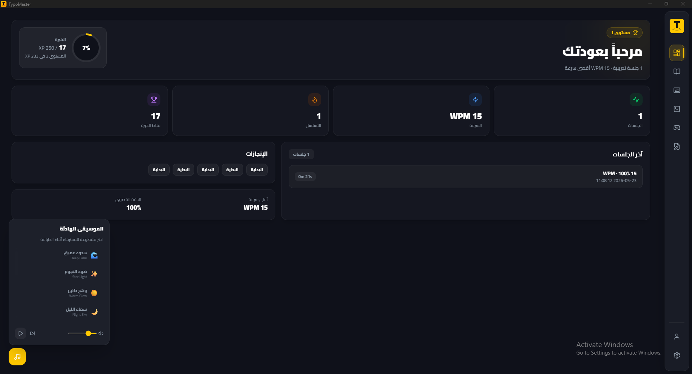
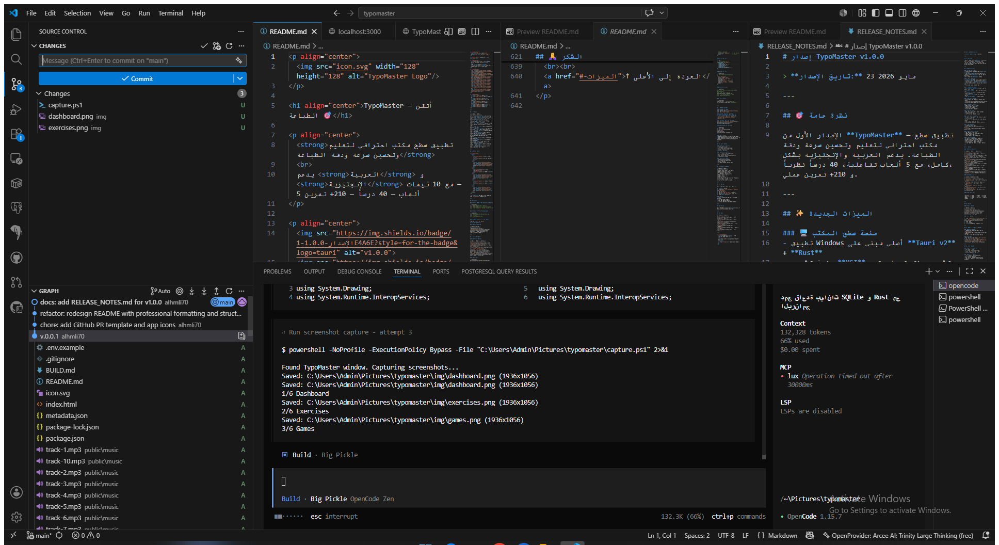
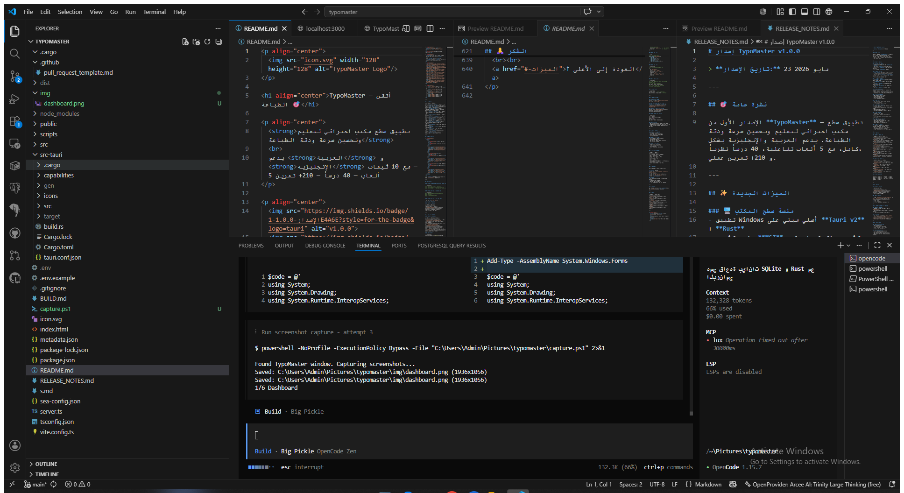
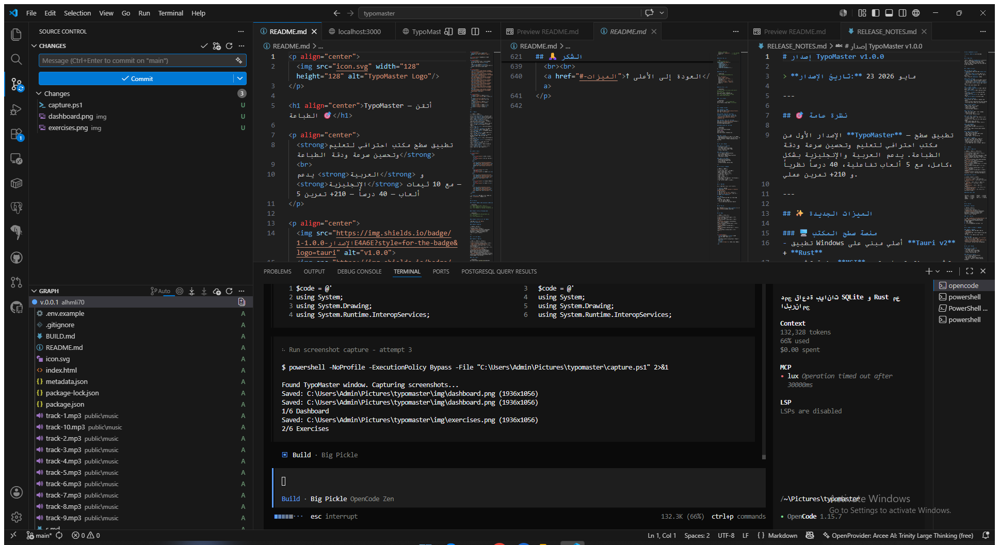
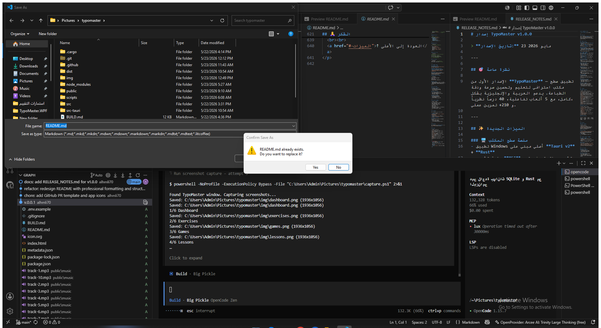
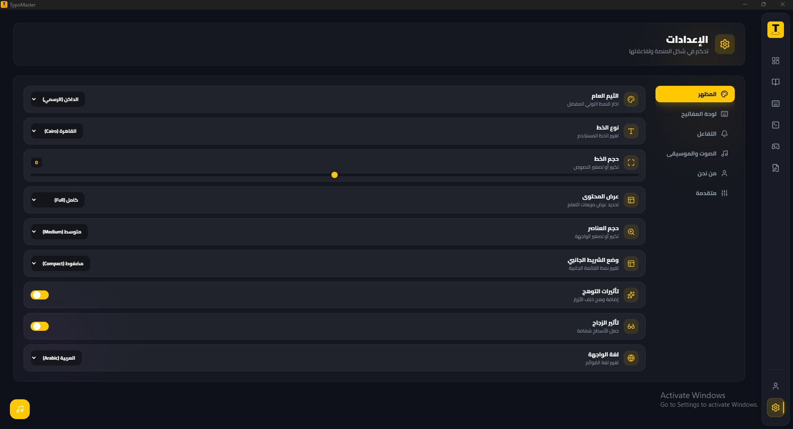

<div align="center">
  
</div>

<p align="center">
  <a href="#english">🇬🇧 English</a> •
  <a href="#arabic">🇸🇦 العربية</a> •
  <a href="RELEASE_NOTES.md">📝 Release Notes</a>
</p>

---

<a id="english"></a>

<h1 align="center">⌨️ TypoMaster — Master Your Typing</h1>

<p align="center">
  <strong>Professional bilingual typing trainer</strong> — built with React 19 + Tauri 2 + Rust + SQLite.
  <br>
  210+ exercises • 40 lessons • 5 games • 10 themes • AI tips • Real-time analytics
</p>

<div align="center">


[](https://github.com/alhmli70/typomaster/stargazers)
[](https://github.com/alhmli70/typomaster/releases)
[](LICENSE)
[](https://github.com/alhmli70/typomaster/releases)
[](https://github.com/alhmli70/typomaster/commits/main)
[](https://github.com/alhmli70/typomaster)
[](https://github.com/alhmli70/typomaster)
[](/../../pulls)

</div>

---

## ✨ Features

<table>
  <tr>
    <td width="25%" align="center">
      <strong>📚 40 Lessons</strong>
      <br><small>20 Arabic + 20 English</small>
    </td>
    <td width="25%" align="center">
      <strong>⌨️ 210+ Exercises</strong>
      <br><small>3 levels • 10 collections</small>
    </td>
    <td width="25%" align="center">
      <strong>🎮 5 Games</strong>
      <br><small>Interactive & fun</small>
    </td>
    <td width="25%" align="center">
      <strong>📊 Analytics</strong>
      <br><small>WPM • Accuracy • XP</small>
    </td>
  </tr>
  <tr>
    <td align="center">
      <strong>🎨 10 Themes</strong>
      <br><small>5 dark + 5 light</small>
    </td>
    <td align="center">
      <strong>🎵 Background Music</strong>
      <br><small>10 MP3 tracks</small>
    </td>
    <td align="center">
      <strong>🏆 10+ Achievements</strong>
      <br><small>XP & Levels</small>
    </td>
    <td align="center">
      <strong>🤖 AI Tips</strong>
      <br><small>Built-in, offline</small>
    </td>
  </tr>
  <tr>
    <td align="center">
      <strong>👆 Virtual Keyboard</strong>
      <br><small>Arabic + English</small>
    </td>
    <td align="center">
      <strong>💽 SQLite Local DB</strong>
      <br><small>No data loss</small>
    </td>
    <td align="center">
      <strong>🔒 Strict Mode</strong>
      <br><small>No backspace</small>
    </td>
    <td align="center">
      <strong>🌙 Dark/Light</strong>
      <br><small>Instant toggle</small>
    </td>
  </tr>
</table>

---

## 📸 Screenshots

<p align="center">
  <table>
    <tr>
      <td align="center"><b>Dashboard</b></td>
      <td align="center"><b>Lessons</b></td>
    </tr>
    <tr>
      <td></td>
      <td></td>
    </tr>
    <tr>
      <td align="center"><b>Exercises</b></td>
      <td align="center"><b>Games</b></td>
    </tr>
    <tr>
      <td></td>
      <td></td>
    </tr>
    <tr>
      <td align="center"><b>Profile</b></td>
      <td align="center"><b>Settings</b></td>
    </tr>
    <tr>
      <td></td>
      <td></td>
    </tr>
  </table>
</p>

> 💡 Screenshots are updated with each release.

---

## 🚀 Tech Stack

<div align="center">
  <table>
    <tr>
      <th>Category</th>
      <th>Technology</th>
    </tr>
    <tr><td><strong>Frontend</strong></td><td>React 19, TypeScript, Tailwind CSS 4, Motion, Lucide</td></tr>
    <tr><td><strong>Backend</strong></td><td>Rust 2021, Tauri 2, Serde</td></tr>
    <tr><td><strong>Database</strong></td><td>SQLite (rusqlite), sql.js (browser)</td></tr>
    <tr><td><strong>Tooling</strong></td><td>Vite 6, Node.js 20+, npm 10+</td></tr>
    <tr><td><strong>Build</strong></td><td>Windows MSI Installer, Portable EXE</td></tr>
  </table>
</div>

---

## 📦 Installation

### Option 1 — MSI Installer (Recommended)

```powershell
# Download from Releases page
# Run TypoMaster_1.0.0_x64_en-US.msi
# Follow the setup wizard
```

### Option 2 — Portable EXE

```powershell
# Download TypoMaster_x64_portable.zip
# Extract & run typomaster.exe
```

### Option 3 — Build from Source

See [Building from Source](#-building-from-source).

---

## 🛠 Building from Source

### Prerequisites

| Tool | Version | Install |
|------|---------|---------|
| [Node.js](https://nodejs.org/) | ≥ 20 | `winget install OpenJS.NodeJS.LTS` |
| [npm](https://www.npmjs.com/) | ≥ 10 | Comes with Node.js |
| [Rust](https://www.rust-lang.org/) | ≥ 1.77 | `rustup install stable` |
| [VS 2022 Build Tools](https://visualstudio.microsoft.com/downloads/#build-tools-for-visual-studio-2022) | 2022 | "Desktop development with C++" |
| [Windows SDK](https://developer.microsoft.com/en-us/windows/downloads/windows-sdk/) | ≥ 10.0.19041 | Included with VS |

### Build Commands

```powershell
git clone https://github.com/alhmli70/typomaster.git
cd typomaster
npm install
npx tauri build --bundles msi
```

### Development Commands

| Command | Description |
|---------|-------------|
| `npm run dev:tauri` | Start Vite dev server on port 1420 |
| `npx tauri dev` | Run Tauri + Vite (Hot Reload) |
| `npm run build` | Build frontend only |
| `npm run lint` | TypeScript check (`tsc --noEmit`) |

### Build Outputs

| File | Path |
|------|------|
| Desktop app (EXE) | `src-tauri/target/release/typomaster.exe` |
| Windows Installer (MSI) | `src-tauri/target/release/bundle/msi/TypoMaster_1.0.0_x64_en-US.msi` |
| Frontend bundle (Vite) | `dist/` |

---

## 🏗 Architecture

```
📦 TypoMaster
├── 📂 src/                   # Frontend — React 19 + TypeScript
│   ├── 📂 components/        # 25+ components
│   ├── 📂 contexts/          # 4 React Contexts
│   ├── 📂 database/          # Dual-mode DB layer
│   ├── 📂 lib/               # Utilities
│   └── 📂 data/              # 40 lessons data
├── 📂 src-tauri/             # Backend — Rust + Tauri 2
│   ├── 📂 src/               # 30 commands + SQLite
│   └── 📄 Cargo.toml         # Rust dependencies
├── 📂 public/music/          # 10 MP3 tracks
├── 📄 icon.svg               # App icon
├── 📄 vite.config.ts         # Vite config
└── 📄 package.json           # npm dependencies
```

### Data Flow

```
┌──────────────────┐
│  React Components │
└────────┬─────────┘
         │ invoke('command')
┌────────▼─────────┐
│  Rust Tauri Cmd  │
└────────┬─────────┘
         │
┌────────▼─────────┐
│    SQLite DB     │
│  (AppData/*.db)  │
└──────────────────┘
```

### Dual-Mode

```typescript
// The app automatically runs in two modes:
if (window.__TAURI__) {
  // 🖥️ Tauri mode: Rust commands → persistent SQLite
} else {
  // 🌐 Browser mode: localStorage + offline tips (testing)
}
```

---

## 🎮 Games

| Game | Description | Goal |
|------|-------------|------|
| 🌊 **Falling Words** | Words fall from above — type before they hit the ground | Speed + Accuracy |
| 🎯 **Typer Shooter** | Words appear randomly — snipe them before they vanish | Reflex + Focus |
| 🥷 **Ninja Typer** | Letters jump and fade — type them in time | Reaction Speed |
| 🧠 **Memory Typing** | Word appears then disappears — type from memory | Muscle Memory |
| 🏎️ **Speed Race** | Race against time — type as many correct words as possible | Endurance + Speed |

---

## 🔑 Quick Start Guide

### Beginner — First 10 Minutes
1. **Launch the app** → Find TypoMaster in Start Menu
2. **Choose your language** → Arabic or English from home screen
3. **Learn basics** → Go to Lessons → Start with Lesson 1
4. **Practice** → Exercises → Pick a collection
5. **Have fun** → Try Falling Words in Games
6. **Track progress** → Check Dashboard

### Intermediate — Speed Improvement
1. **Set WPM goal** → e.g., 40 WPM in Settings
2. **Speed exercises** → Focus on speed collection
3. **Enable Strict Mode** → Boost accuracy
4. **Analyze errors** → Review stats after each session

### Advanced — Mastery
1. **Daily challenge** → Play Speed Race daily
2. **Custom exercises** → Create your own via ExerciseManager
3. **Maintain streak** → 30 days for "Perseverance Legend" achievement

---

## ⌨️ Keyboard Shortcuts

| Shortcut | Action |
|:--------:|--------|
| `Ctrl + 1–9` | Navigate sidebar sections |
| `Ctrl + D` | Dashboard |
| `Ctrl + T` | Exercises |
| `Ctrl + L` | Lessons |
| `Ctrl + G` | Games |
| `Ctrl + S` | Settings |
| `Ctrl + M` | Toggle music |
| `Esc` | Cancel / Back |
| `Enter` | Finish exercise |
| `Tab` | Skip word |
| `Ctrl + Z` | Undo (normal mode) |

---

## ❓ FAQ

### Music not working?
Ensure `public/music/track-1.mp3` through `track-10.mp3` exist.

### How to reset all data?
**Settings → Advanced → Reset All Data**, or delete `%APPDATA%/com.typomaster.desktop/TypoMaster.db`.

### App won't open after install?
Install [WebView2 Runtime](https://developer.microsoft.com/en-us/microsoft-edge/webview2/).

### Slow performance?
- Reduce Glassmorphism in Settings → Appearance
- Disable Keyboard Visualizer if not needed
- Close heavy apps (WebView2 uses GPU)

---

## 🗺 Roadmap

### v1.1 (Coming Soon)
- macOS & Linux support
- Daily Challenge
- Export stats (CSV / PDF)
- Per-finger analysis

### v1.2 (Planned)
- Multi-profile accounts
- Community exercise marketplace
- Deep Practice mode
- Dvorak, Colemak support

### v2.0 (Vision)
- Competitive Multiplayer
- HTML/CSS beginner interface
- Course Builder
- GitHub, Notion API integration

---

## 📊 Project Stats

| Metric | Value |
|--------|:-----:|
| Total Code Lines | ~15,000+ |
| TypeScript Files | 50+ |
| Tauri Commands | 30 |
| Database Tables | 7 |
| React Components | 25+ |
| Themes | 10 |
| Interactive Games | 5 |
| Lessons | 40 (20 ar + 20 en) |
| Exercises | 210+ |
| MSI Package Size | ~28 MB |

---

## 🤝 Contributing

Contributions are welcome! Please follow:

1. **Fork** the repo
2. Create branch: `git checkout -b feature/amazing-feature`
3. Make changes
4. Run `npm run lint` (no errors)
5. Verify `npx tauri build` succeeds
6. Open **Pull Request**

### Guidelines
- TypeScript for frontend — Rust for backend
- Follow existing code style
- Ensure RTL support for Arabic
- Test in Tauri dev mode before submitting

---

## ⭐ Support

If you like this project, please give it a ⭐ **Star** on GitHub — it helps others discover it!

<div align="center">

[](https://github.com/alhmli70/typomaster/stargazers)
[](https://github.com/alhmli70/typomaster/network/members)
[](https://github.com/alhmli70/typomaster/watchers)

</div>

---

## 📄 License

This project is licensed under the **MIT License** — see the [LICENSE](LICENSE) file for details.

---

## 🙏 Acknowledgments

| Technology | Usage |
|------------|-------|
| [Tauri](https://tauri.app/) | Desktop application framework |
| [React](https://react.dev/) | UI library |
| [Tailwind CSS](https://tailwindcss.com/) | Design system |
| [SQLite](https://sqlite.org/) | Embedded database |
| [Lucide](https://lucide.dev/) | Icons |
| [Motion](https://motion.dev/) | Animations |
| [Vite](https://vitejs.dev/) | Build tool |

---

<div align="center">
  <br>
  <a href="https://github.com/alhmli70/typomaster">
    
  </a>
  <br><br>
  <sub>Built with ❤️ using Tauri + React + Rust</sub>
  <br><br>
  <a href="#english">↑ Back to top</a>
</div>

---

<br>

<a id="arabic"></a>

<h1 align="center">⌨️ TypoMaster — أتقن الطباعة</h1>

<p align="center">
  <strong>برنامج احترافي لتعليم الطباعة بالعربية والإنجليزية</strong>
  <br>
  مبني باستخدام React 19 + Tauri 2 + Rust + SQLite
</p>

<div align="center">


[](https://github.com/alhmli70/typomaster/stargazers)
[](https://github.com/alhmli70/typomaster/releases)

</div>

---

## 🚀 الميزات

| | الميزة | الوصف |
|:---:|-------|-------|
| 🎓 | **40 درساً نظرياً** | 20 عربي + 20 إنجليزي — من المفاتيح الرئيسية إلى السرعة |
| ⌨️ | **210+ تمرين عملي** | 10 مجموعات — 3 مستويات صعوبة — تمارين تصاعدية |
| 🎮 | **5 ألعاب تفاعلية** | الكلمات المتساقطة • قناص مسافة • نينجا الحروف • ذاكرة الطباعة • سباق السرعة |
| 📊 | **إحصائيات متقدمة** | WPM • الدقة • الأخطاء • رسوم بيانية أسبوعية • Streak الأيام |
| 🏆 | **10+ إنجازات** | نظام XP • مستويات • شارات الإنجاز |
| 🎨 | **10 ثيمات احترافية** | 5 غامقة + 5 فاتحة (بيج فاخر) — ألوان أكسنت مميزة |
| 🎵 | **موسيقى خلفية** | 10 مقطوعات MP3 • تحكم كامل بالصوت |
| 🔊 | **مؤثرات صوتية** | أصوات للكتابة • الأخطاء • الإنجازات • التنقل |
| 👆 | **لوحة مفاتيح افتراضية** | عربي • إنجليزي • تلوين الأصابع • وضع اليد المساعدة |
| 🤖 | **نصائح ذكية** | مدمجة بدون إنترنت • مخصصة لكل درس |
| 🌙 | **وضع مظلم / فاتح** | تبديل فوري • 5 ثيمات لكل وضع |
| 🔄 | **وضع صارم** | منع التراجع عن الأخطاء — لتدريب الانضباط |
| 📈 | **تتبع التقدم** | يومي • أسبوعي • إجمالي • رسوم بيانية |
| 💽 | **SQLite مدمجة** | قاعدة بيانات محلية دائمة — لا فقدان للبيانات |

---

## 📸 لقطات الشاشة

<p align="center">
  <table>
    <tr>
      <td align="center"><b>لوحة التحكم</b></td>
      <td align="center"><b>الدروس النظرية</b></td>
    </tr>
    <tr>
      <td></td>
      <td></td>
    </tr>
    <tr>
      <td align="center"><b>اختيار التمارين</b></td>
      <td align="center"><b>الألعاب</b></td>
    </tr>
    <tr>
      <td></td>
      <td></td>
    </tr>
    <tr>
      <td align="center"><b>الملف الشخصي</b></td>
      <td align="center"><b>الإعدادات</b></td>
    </tr>
    <tr>
      <td></td>
      <td></td>
    </tr>
  </table>
</p>

---

## 📥 التثبيت

### الطريقة الأولى — MSI Installer (موصى به)

```powershell
# 1. حمّل الملف من صفحة الإصدارات
# 2. نفّذ TypoMaster_1.0.0_x64_en-US.msi
# 3. اتبع التعليمات — التطبيق جاهز للاستخدام
```

### الطريقة الثانية — Portable EXE

```powershell
# 1. حمّل TypoMaster_x64_portable.zip
# 2. فك الضغط
# 3. شغّل typomaster.exe
```

### الطريقة الثالثة — بناء من المصدر

انظر قسم **[بناء من المصدر](#بناء-من-المصدر)**.

---

## 🛠 بناء من المصدر

### المتطلبات الأساسية

| الأداة | الإصدار | التثبيت |
|--------|---------|---------|
| [Node.js](https://nodejs.org/) | ≥ 20 | `winget install OpenJS.NodeJS.LTS` |
| [npm](https://www.npmjs.com/) | ≥ 10 | يأتي مع Node.js |
| [Rust](https://www.rust-lang.org/) | ≥ 1.77 | `rustup install stable` |
| [VS 2022 Build Tools](https://visualstudio.microsoft.com/downloads/#build-tools-for-visual-studio-2022) | 2022 | "Desktop development with C++" |
| [Windows SDK](https://developer.microsoft.com/en-us/windows/downloads/windows-sdk/) | ≥ 10.0.19041 | مثبت مع VS |

### خطوات البناء

```powershell
git clone https://github.com/alhmli70/typomaster.git
cd typomaster
npm install
npx tauri build --bundles msi
```

### أوامر التطوير

| الأمر | الشرح |
|-------|-------|
| `npm run dev:tauri` | تشغيل Vite على port 1420 |
| `npx tauri dev` | تشغيل Tauri + Vite (Hot Reload) |
| `npm run build` | بناء الواجهة فقط |
| `npm run lint` | فحص TypeScript |

### مخرجات البناء

| الملف | المسار |
|-------|--------|
| تطبيق سطح المكتب (EXE) | `src-tauri/target/release/typomaster.exe` |
| مثبت ويندوز (MSI) | `src-tauri/target/release/bundle/msi/TypoMaster_1.0.0_x64_en-US.msi` |
| ملفات الواجهة (Vite) | `dist/` |

---

## 🏗 الهندسة

### هيكل المشروع

```
📦 TypoMaster
├── 📂 src/                           # Frontend — React 19 + TypeScript
│   ├── 📂 components/                #  25+ مكون React
│   │   ├── 📄 Dashboard.tsx            لوحة التحكم الرئيسية
│   │   ├── 📄 TypingInterface.tsx      واجهة الطباعة
│   │   ├── 📄 ExerciseSelection.tsx    اختيار التمارين
│   │   ├── 📄 Lessons.tsx              الدروس النظرية
│   │   ├── 📄 GamesMenu.tsx            قائمة الألعاب
│   │   ├── 📄 Settings.tsx             الإعدادات (6 تبويبات)
│   │   ├── 📄 Profile.tsx              الملف الشخصي والإنجازات
│   │   ├── 📄 ExerciseManager.tsx      إدارة التمارين (CRUD)
│   │   ├── 📄 Sidebar.tsx              شريط التنقل الجانبي
│   │   ├── 📄 VirtualKeyboard.tsx      لوحة المفاتيح الافتراضية
│   │   ├── 📄 MusicToggle.tsx           مشغل الموسيقى
│   │   ├── 📄 Logo.tsx                 شعار التطبيق (SVG)
│   │   └── 📁 Games/                   5 ألعاب تفاعلية
│   ├── 📂 contexts/                   # React Contexts
│   ├── 📂 database/                   # طبقة قاعدة البيانات
│   ├── 📂 lib/                        # مكتبات مساعدة
│   └── 📂 data/                       # بيانات ثابتة
│
├── 📂 src-tauri/                     # Backend — Rust + Tauri v2
│   ├── 📂 src/
│   │   ├── 📄 main.rs                  نقطة الدخول
│   │   └── 📄 lib.rs                   30 Tauri command + SQLite
│   ├── 📄 Cargo.toml                  اعتماديات Rust
│   └── 📄 tauri.conf.json              إعدادات التطبيق
│
├── 📂 public/
│   └── 📂 music/                      10 مقطوعات MP3
├── 📄 icon.svg                        شعار المصدر
├── 📄 vite.config.ts                  إعدادات Vite
└── 📄 package.json                    اعتماديات npm
```

### تدفق البيانات

```
                    ┌──────────────────┐
                    │  React Components │
                    └────────┬─────────┘
                             │
                      invoke('command')
                             │
                    ┌────────▼─────────┐
                    │  Rust Tauri Cmd  │
                    └────────┬─────────┘
                             │
                    ┌────────▼─────────┐
                    │    SQLite DB     │
                    │  (AppData/*.db)  │
                    └──────────────────┘
```

### تقنية العرض المزدوج (Dual-Mode)

```typescript
// التطبيق يعمل في وضعين تلقائياً:
if (window.__TAURI__) {
  // 🖥️ وضع Tauri: أوامر Rust → SQLite دائم
} else {
  // 🌐 وضع المتصفح: localStorage + tips مدمجة (اختبار)
}
```

---

## 🗄 قاعدة البيانات

### الجداول

| الجدول | الحقول | الغرض |
|--------|--------|-------|
| `exercises` | id, title, content, language, level, collection, order | 210+ تمرين |
| `typing_sessions` | id, exercise_id, wpm, accuracy, errors, time_seconds, total_chars, language, created_at | سجل كل جلسة |
| `settings` | key, value | 30+ إعداد |
| `game_scores` | id, game_name, score, language, created_at | نتائج الألعاب |
| `achievements` | id, title, description, unlocked_at | الإنجازات |
| `completed_exercises` | exercise_id | إكمال التمارين |
| `completed_lessons` | lesson_id | إكمال الدروس |

### أوامر Tauri (30)

```rust
// ── التمارين ──
get_all_exercises    // جلب كل التمارين
add_exercise         // إضافة تمرين
update_exercise_cmd  // تحديث تمرين
delete_exercise_cmd  // حذف تمرين
seed_exercises_batch // استيراد مجموعة

// ── الإكمال ──
is_exercise_completed    // هل التمرين مكتمل؟
mark_exercise_completed  // تعليم كمكتمل
get_all_completed_exercises
is_lesson_completed
mark_lesson_completed
get_all_completed_lessons

// ── الإعدادات ──
get_setting        // قراءة إعداد
set_setting_cmd    // كتابة إعداد
clear_all_settings // مسح الكل
get_all_settings   // جلب الكل
save_settings      // حفظ JSON
load_settings      // تحميل JSON

// ── الجلسات ──
record_typing_session  // تسجيل جلسة
get_typing_stats       // إحصائيات عامة
get_recent_sessions    // آخر الجلسات
get_weekly_stats_cmd   // إحصائيات أسبوعية
get_streak             // streak الأيام

// ── الألعاب ──
save_game_score_cmd    // حفظ نتيجة
get_best_game_scores   // أفضل النتائج
get_best_exercise_sessions

// ── الإنجازات ──
get_total_xp_cmd       // مجموع XP
add_achievement_cmd    // إضافة إنجاز
get_achievements_cmd   // جلب الإنجازات
reset_all_data_cmd     // إعادة تعيين الكل

// ── تعليمية ──
get_ai_tip             // نصيحة ذكية
```

---

## 🎮 الألعاب

| اللعبة | الوصف | الهدف |
|--------|-------|-------|
| 🌊 **الكلمات المتساقطة** | كلمات تسقط من الأعلى — اكتبها قبل أن تصل للأرض | السرعة + الدقة |
| 🎯 **قناص مسافة** | كلمات تظهر عشوائياً — أصبها قبل اختفائها | رد الفعل + التركيز |
| 🥷 **نينجا الحروف** | الحروف تقفز وتختفي — اكتبها في الوقت المحدد | سرعة رد الفعل |
| 🧠 **ذاكرة الطباعة** | الكلمة تظهر ثم تختفي — اكتبها من الذاكرة | الذاكرة العضلية |
| 🏎️ **سباق السرعة** | سباق مع الزمن — أكتب أكبر عدد من الكلمات الصحيحة | التحمل + السرعة |

---

## 🎨 الثيمات

### الغامقة (Dark Themes)

| الثيم | المميز | الخلفية | الأكسنت |
|-------|:------:|:-------:|:-------:|
| `midnight-blue` | أزرق غامق | `#0A0E1A` | `#4F8CFF` |
| `deep-purple` | بنفسجي فاخر | `#0D0A1A` | `#9B59B6` |
| `oceanic` | أخضر بحري | `#0A1A14` | `#26C6A0` |
| `forest` | غابي عميق | `#0E1A0A` | `#66BB6A` |
| `electric` | فحمي كهربائي | `#0E0E14` | `#FF6B6B` |

### الفاتحة (Light Themes — بيج فاخر)

| الثيم | المميز | الخلفية | الأكسنت |
|-------|:------:|:-------:|:-------:|
| `clean-light` | ذهبي | `#F5F0E8` | `#B8860B` |
| `peach-light` | عنابي | `#F5EDE6` | `#8B3A4F` |
| `sky-light` | كحلي | `#F0F2F5` | `#1E4A6E` |
| `mint-light` | زمردي | `#F0F5F0` | `#1B6B4A` |
| `gray-light` | برقوقي | `#F2F0F5` | `#5C3D6E` |

---

## 📚 الدروس

### العربية

| # | الدرس | الوصف |
|:-:|-------|-------|
| 1 | مقدمة في الطباعة | أساسيات وضع اليدين والجلوس الصحيح |
| 2 | المفاتيح الرئيسية — منفح | تعلم الصف الأساسي (منفح) |
| 3 | الحروف العلوية والسفلية | الحروف التي ترتفع وتنزل عن السطر |
| 4 | الحروف المتوسطة | الحروف المطموسة والمتوسطة |
| 5 | الحركات والتشكيل | الفتحة، الضمة، الكسرة، والسكون |
| 6 | الأحرف المتصلة والمنفصلة | الفرق بين الحروف في أول، وسط، وآخر الكلمة |
| 7 | الأرقام العربية | الأرقام من ٠ إلى ٩ |
| 8 | الرموز وعلامات الترقيم | النقطة، الفاصلة، وغيرها |
| 9 | تحسين السرعة | تمارين سرعة مكثفة |
| 10 | تمارين شاملة — متوسط | مراجعة وتطبيق |
| 11–20 | تمارين متقدمة | مستويات متقدمة |

### الإنجليزية

| # | Lesson | Description |
|:-:|-------|-------------|
| 1 | Introduction & Posture | Proper hand positioning |
| 2 | Home Row — ASDF JKL; | The foundation row |
| 3 | Top Row — QWERTY UIOP | Upper row mastery |
| 4 | Bottom Row — ZXCVBNM ,./ | Lower row practice |
| 5 | Shift & Capitalization | Capital letters & symbols |
| 6 | Numbers & Symbols | Number row & punctuation |
| 7 | Speed Building | Speed drills & timing |
| 8 | Advanced Techniques | Touch typing mastery |
| 9 | Touch Typing Mastery | No-look typing |
| 10 | Comprehensive Practice | Full review & test |

---

## 🎯 دليل الاستخدام

### للمبتدئين — أول 10 دقائق

1. **شغّل التطبيق** → ابحث عن TypoMaster في قائمة ابدأ
2. **اختر لغتك** → "عربي" أو "English" من الشاشة الرئيسية
3. **ادرس الأساسيات** → اذهب إلى "الدروس" ← ابدأ بالدرس الأول
4. **تدرب** → اذهب إلى "التمارين" ← اختر مجموعة
5. **استمتع** → جرب "الكلمات المتساقطة" في قسم الألعاب
6. **تابع تقدمك** → راجع لوحة التحكم

---

## ⌨️ اختصارات لوحة المفاتيح

| الاختصار | الوظيفة |
|:--------:|---------|
| `Ctrl + 1–9` | التنقل بين أقسام الشريط الجانبي |
| `Ctrl + D` | لوحة التحكم |
| `Ctrl + T` | التمارين |
| `Ctrl + L` | الدروس |
| `Ctrl + G` | الألعاب |
| `Ctrl + S` | الإعدادات |
| `Ctrl + M` | تشغيل / إيقاف الموسيقى |
| `Esc` | إلغاء أو عودة |
| `Enter` (طباعة) | إنهاء التمرين |
| `Tab` (طباعة) | تخطي الكلمة |
| `Ctrl + Z` | تراجع (في الوضع العادي) |

---

## 👨‍💻 التطوير

### إضافة تمرين جديد

```typescript
{
  id: "exercise-ar-speed-1",
  title: "تمرين السرعة ١",
  content: "نص التمرين هنا...",
  language: "ar",           // ar | en
  level: "medium",          // beginner | medium | advanced
  collection: "speed-ar",   // اسم المجموعة
  order: 1                  // الترتيب
}
```

### إضافة ثيم جديد

```css
/* في src/index.css */
[data-theme='my-theme'] {
  --app-bg: #...;
  --app-surface: #...;
  --app-accent: #...;
  --app-text: #...;
  --app-text-secondary: #...;
}
```

### إضافة درس جديد

```typescript
// في src/data/lessonsData.tsx
{
  id: 'my-lesson',
  title: 'عنوان الدرس',
  description: 'شرح الدرس...',
  language: 'ar',
  tips: ['نصيحة ١', 'نصيحة ٢'],
  keywords: ['كلمة١', 'كلمة٢'],
  order: 1
}
```

---

## 💖 دعم المشروع

إذا أعجبك المشروع، لا تنسَ وضع **⭐ Star** على GitHub — هذا يساعد الآخرين في اكتشافه!

[](https://github.com/alhmli70/typomaster/stargazers)
[](https://github.com/alhmli70/typomaster/network/members)
[](https://github.com/alhmli70/typomaster/watchers)

---

## 📄 الترخيص

هذا المشروع مرخص تحت **MIT License** — راجع ملف [LICENSE](LICENSE) للتفاصيل.

---

## 🙏 الشكر

| التقنية | الاستخدام |
|---------|-----------|
| [Tauri](https://tauri.app/) | إطار تطبيقات سطح المكتب |
| [React](https://react.dev/) | مكتبة الواجهات |
| [Tailwind CSS](https://tailwindcss.com/) | نظام التصميم |
| [SQLite](https://sqlite.org/) | قاعدة البيانات المدمجة |
| [Lucide](https://lucide.dev/) | الأيقونات |
| [Motion](https://motion.dev/) | الحركات التفاعلية |
| [Vite](https://vitejs.dev/) | أداة البناء |

---

## 📊 إحصائيات المشروع

| المقياس | القيمة |
|---------|:------:|
| إجمالي سطور الكود | ~15,000+ |
| ملفات TypeScript | 50+ |
| أوامر Tauri (Rust) | 30 |
| جداول قاعدة البيانات | 7 |
| مكونات React | 25+ |
| ثيمات | 10 |
| ألعاب تفاعلية | 5 |
| دروس نظرية | 40 (20 عربي + 20 إنجليزي) |
| تمارين عملية | 210+ |
| حزمة التثبيت (MSI) | ~28 MB |

---

## 🤝 المساهمة

نرحب بالمساهمات! يرجى اتباع الخطوات:

1. **Fork** المشروع
2. أنشئ فرعاً: `git checkout -b feature/amazing-feature`
3. نفذ التغييرات
4. تأكد من `npm run lint` بدون أخطاء
5. تأكد من `npx tauri build` يبني بنجاح
6. أرسل **Pull Request**

### القواعد
- استخدم TypeScript للواجهة — Rust للـ backend
- اتبع نمط الكود الموجود
- تأكد من دعم RTL للعربية
- اختبر في وضع Tauri dev قبل الإرسال

---

## 📋 خريطة الطريق

| الإصدار | الميزات |
|---------|---------|
| **v1.1** (قريباً) | macOS & Linux • Daily Challenge • Export CSV/PDF • Per-finger stats |
| **v1.2** (مخطط) | Multi-profile • Community marketplace • Deep Practice • Dvorak/Colemak |
| **v2.0** (طموح) | Competitive Multiplayer • HTML/CSS interface • Course Builder • GitHub/Notion API |

---

<p align="center">
  <strong>TypoMaster</strong> — أتقن الطباعة، أتقن الإنتاجية 🚀
  <br>
  <sub>Built with ❤️ using Tauri + React + Rust</sub>
  <br><br>
  <a href="#english">↑ العودة إلى الأعلى</a>
</p>

<!--
GitHub Topics Keywords:
typing-tutor, typing-master, learn-typing, typing-speed, touch-typing,
arabic-typing, english-typing, keyboard-practice, typing-exercises, typing-games,
tauri-app, desktop-application, react-app, rust-app, sqlite-app,
typing-trainer, typing-lessons, keyboard-trainer, windows-app, wpm
-->
