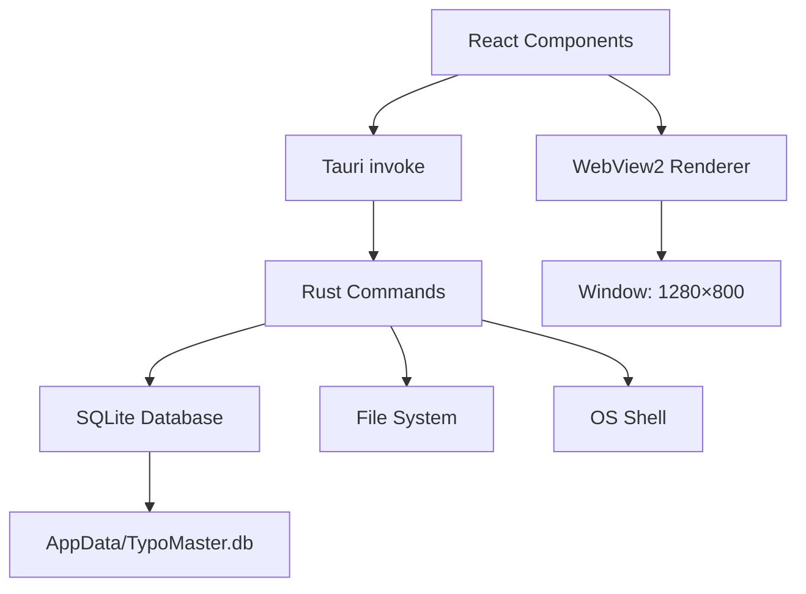

# TypoMaster — أتقن الطباعة 🎯

<p align="center">
  
</p>

<p align="center">
  <strong>تطبيق سطح مكتب احترافي لتعليم وتحسين سرعة ودقة الطباعة</strong>
  <br />
  يدعم العربية والإنجليزية مع 5 ألعاب تفاعلية و 40 درساً نظرياً و 210+ تمرين عملي
</p>

<p align="center">
  <a href="#-الميزات">الميزات</a> •
  <a href="#-لقطات-الشاشة">لقطات</a> •
  <a href="#-التثبيت">تثبيت</a> •
  <a href="#-بناء-من-المصدر">بناء</a> •
  <a href="#-الهندسة">هندسة</a> •
  <a href="#-الثيمات">ثيمات</a> •
  <a href="#-الألعاب">ألعاب</a>
</p>

<p align="center">
  
  
  
  
  
  
  
</p>

---

## ✨ الميزات

| الفئة | الميزة | الوصف |
|-------|--------|-------|
| 🎓 | **40 درساً نظرياً** | 20 درس عربي + 20 درس إنجليزي، من المفاتيح الرئيسية إلى السرعة |
| ⌨️ | **210+ تمرين عملي** | تمارين تصاعدية عبر 10 مجموعات، 3 مستويات صعوبة |
| 🎮 | **5 ألعاب تفاعلية** | الكلمات المتساقطة، قناص مسافة، نينجا الحروف، ذاكرة الطباعة، سباق السرعة |
| 📊 | **إحصائيات متقدمة** | WPM، الدقة، الأخطاء، خطوط البيانية الأسبوعية، streak الأيام |
| 🏆 | **نظام إنجازات** | 10+ إنجازات مع XP وخبرة ومستويات |
| 🎨 | **10 ثيمات احترافية** | 5 ثيمات غامقة + 5 ثيمات فاتحة بتصميم beige فاخر |
| 🎵 | **موسيقى خلفية** | 10 مقطوعات مع تحكم كامل بالصوت |
| 🔊 | **مؤثرات صوتية** | أصوات تفاعلية للكتابة، الأخطاء، الإنجازات |
| 👆 | **لوحة مفاتيح افتراضية** | تدعم العربية والإنجليزية مع تلوين الأصابع |
| 🤖 | **نصائح ذكية** | نصائح مدمجة لكل درس (بدون إنترنت) |
| 🌙 | **وضع مظلم/فاتح** | تبديل فوري بين الثيمات |
| 🔄 | **وضع صارم** | يمنع التراجع عن الأخطاء لتدريب الانضباط |
| 📈 | **تتبع التقدم** | إحصائيات يومية، أسبوعية، وإجمالية |
| 💽 | **SQLite مدمجة** | قاعدة بيانات محلية دائمة — لا فقدان للبيانات |

---

## 📸 لقطات الشاشة

<p align="center">
  <table>
    <tr>
      <td align="center"><b>لوحة التحكم</b></td>
      <td align="center"><b>واجهة الطباعة</b></td>
    </tr>
    <tr>
      <td></td>
      <td></td>
    </tr>
    <tr>
      <td align="center"><b>اختيار التمارين</b></td>
      <td align="center"><b>الألعاب</b></td>
    </tr>
    <tr>
      <td></td>
      <td></td>
    </tr>
    <tr>
      <td align="center"><b>الدروس النظرية</b></td>
      <td align="center"><b>الإعدادات</b></td>
    </tr>
    <tr>
      <td></td>
      <td></td>
    </tr>
  </table>
</p>

---

## 📥 التثبيت

### الطريقة 1: تحميل MSI Installer (موصى به)

1. انتقل إلى [صفحة الإصدارات](../../releases/latest)
2. حمّل `TypoMaster_1.0.0_x64_en-US.msi`
3. نفّذ الملف واتبع التعليمات
4. سيظهر التطبيق في قائمة ابدأ وسطح المكتب

### الطريقة 2: Portable EXE

1. من [صفحة الإصدارات](../../releases/latest)
2. حمّل `TypoMaster_x64_portable.zip`
3. فك الضغط وشغّل `typomaster.exe`

### الطريقة 3: بناء من المصدر

انظر قسم [بناء من المصدر](#-بناء-من-المصدر).

---

## 🛠 بناء من المصدر

### المتطلبات الأساسية

| الأداة | الإصدار | ملاحظة |
|--------|---------|--------|
| [Node.js](https://nodejs.org/) | ≥ 20 | ضروري لبناء الواجهة |
| [npm](https://www.npmjs.com/) | ≥ 10 | يأتي مع Node.js |
| [Rust](https://www.rust-lang.org/) | ≥ 1.77 | `rustup install stable` |
| [VS 2022 Build Tools](https://visualstudio.microsoft.com/downloads/#build-tools-for-visual-studio-2022) | 2022 | مع "Desktop development with C++" |
| [Windows SDK](https://developer.microsoft.com/en-us/windows/downloads/windows-sdk/) | ≥ 10.0.19041 | لتجميع Rust على Windows |

### خطوات البناء

```powershell
# 1. استنساخ المستودع
git clone https://github.com/yourusername/typomaster.git
cd typomaster

# 2. تثبيت اعتماديات الواجهة
npm install

# 3. بناء تطبيق سطح المكتب مع MSI
npx tauri build --bundles msi
```

### أوامر التطوير

```powershell
# تشغيل وضع التطوير (Hot Reload)
npm run dev:tauri     # شغّل Vite
npx tauri dev         # شغّل Tauri + Vite معاً

# بناء الواجهة فقط
npm run build

# فحص الأخطاء (TypeScript)
npm run lint

# إنشاء أيقونات
npx tauri icon icon.svg -o src-tauri/icons
```

### مخرجات البناء

| الملف | المسار |
|-------|--------|
| تطبيق سطح المكتب (EXE) | `src-tauri/target/release/typomaster.exe` |
| مثبت ويندوز (MSI) | `src-tauri/target/release/bundle/msi/TypoMaster_1.0.0_x64_en-US.msi` |
| ملفات الواجهة (Vite) | `dist/` |

---

## 🏗 الهندسة

### نظرة عامة على البنية

```
TypoMaster/
├── src/                              # Frontend (React 19 + TypeScript)
│   ├── components/                   # مكونات React
│   │   ├── Dashboard.tsx             # لوحة التحكم الرئيسية
│   │   ├── TypingInterface.tsx       # واجهة الطباعة الأساسية
│   │   ├── ExerciseSelection.tsx     # اختيار التمارين
│   │   ├── Lessons.tsx               # الدروس النظرية
│   │   ├── GamesMenu.tsx             # قائمة الألعاب
│   │   ├── Settings.tsx              # الإعدادات (6 تبويبات)
│   │   ├── Profile.tsx               # الملف الشخصي والإنجازات
│   │   ├── ExerciseManager.tsx       # إدارة التمارين (CRUD)
│   │   ├── Sidebar.tsx              # شريط التنقل الجانبي
│   │   ├── VirtualKeyboard.tsx       # لوحة المفاتيح الافتراضية
│   │   ├── MusicToggle.tsx           # مشغل الموسيقى
│   │   ├── Logo.tsx                  # شعار التطبيق (SVG)
│   │   └── Games/                    # 5 ألعاب تفاعلية
│   ├── contexts/                     # React Contexts (حالة عامة)
│   │   ├── SettingsContext.tsx        # حالة الإعدادات
│   │   ├── SessionContext.tsx         # حالة الجلسات والإحصائيات
│   │   ├── ExerciseContext.tsx        # حالة التمارين
│   │   └── SoundContext.tsx           # حالة الصوت والموسيقى
│   ├── database/                     # طبقة قاعدة البيانات
│   │   ├── db.ts                     # كشف بيئة Tauri/متصفح
│   │   ├── driver.ts                 # محرك قاعدة البيانات (مزدوج)
│   │   └── repositories/             # 4 مستودعات للبيانات
│   ├── lib/                          # مكتبات مساعدة
│   │   ├── musicEngine.ts            # محرك الموسيقى (MP3/HTMLAudio)
│   │   ├── soundEngine.ts            # محرك المؤثرات الصوتية
│   │   ├── stars.ts                  # حساب النجوم
│   │   └── offlineTips.ts            # نصائح مدمجة بدون إنترنت
│   └── data/                         # بيانات ثابتة
│       └── lessonsData.tsx            # محتوى 40 درساً + 400+ كلمة
├── src-tauri/                        # Backend (Rust + Tauri v2)
│   ├── src/
│   │   ├── main.rs                   # نقطة الدخول
│   │   └── lib.rs                    # 30 Tauri command + SQLite
│   ├── Cargo.toml                    # اعتماديات Rust
│   ├── tauri.conf.json               # إعدادات التطبيق
│   └── capabilities/default.json     # صلاحيات (fs, shell, core)
├── public/                           # ملفات ثابتة (موسيقى، إلخ)
│   └── music/                        # 10 مقطوعات MP3
├── icon.svg                          # شعار SVG المصدر
├── vite.config.ts                    # إعدادات Vite
└── package.json                      # اعتماديات npm
```

### المعمارية: Frontend → Backend



**تيار البيانات:**
1. المستخدم يضغط زر في React
2. React يستدعي `invoke('command_name', params)` من `@tauri-apps/api/core`
3. Rust backend يستقبل الأمر، ينفذ SQL على SQLite
4. النتيجة تعود كـ JSON إلى الواجهة
5. React يحدّث الـ UI

### قاعدة البيانات (SQLite)

**الموقع:** `%APPDATA%/com.typomaster.desktop/TypoMaster.db`

**الجداول:**

| الجدول | الوصف |
|--------|-------|
| `exercises` | 210+ تمرين (id, title, content, language, level, collection, order) |
| `typing_sessions` | سجل كل جلسة كتابة (wpm, accuracy, errors, time, chars, language) |
| `settings` | إعدادات key-value (30+ إعداد) |
| `game_scores` | أعلى النتائج لكل لعبة |
| `achievements` | الإنجازات المفتوحة |
| `completed_exercises` | track لكل تمرين مكتمل |
| `completed_lessons` | track لكل درس مكتمل |

### أوامر Tauri (30 أمراً)

```
التمارين:    get_all_exercises | add_exercise | update_exercise_cmd
             delete_exercise_cmd | seed_exercises_batch

الإكمال:     is_exercise_completed | mark_exercise_completed
             get_all_completed_exercises | is_lesson_completed
             mark_lesson_completed | get_all_completed_lessons

الإعدادات:   get_setting | set_setting_cmd | clear_all_settings
             get_all_settings | save_settings | load_settings

الجلسات:     record_typing_session | get_typing_stats
             get_recent_sessions | get_weekly_stats_cmd | get_streak

الألعاب:     save_game_score_cmd | get_best_game_scores
             get_best_exercise_sessions

الإنجازات:   get_total_xp_cmd | add_achievement_cmd
             get_achievements_cmd | reset_all_data_cmd

تعليمية:     get_ai_tip
```

### تقنية العرض المزدوج (Dual-Mode)

```typescript
// auto-detection في db.ts
if (window.__TAURI__) {
  // Tauri: استدعاء أوامر Rust ← SQLite حقيقي
} else {
  // متصفح: localStorage + tips مدمجة (للاختبار فقط)
}
```

---

## 🎨 الثيمات

### الغامقة (Dark Themes)

| الثيم | المميز | الخلفية | الأكسنت |
|-------|--------|---------|---------|
| `midnight-blue` | أزرق غامق | `#0A0E1A` | `#4F8CFF` |
| `deep-purple` | بنفسجي فاخر | `#0D0A1A` | `#9B59B6` |
| `oceanic` | أخضر بحري | `#0A1A14` | `#26C6A0` |
| `forest` | غابي عميق | `#0E1A0A` | `#66BB6A` |
| `electric` | فحمي كهربائي | `#0E0E14` | `#FF6B6B` |

### الفاتحة (Light Themes — بيج فاخر)

| الثيم | المميز | الخلفية | الأكسنت |
|-------|--------|---------|---------|
| `clean-light` | ذهبي | `#F5F0E8` | `#B8860B` |
| `peach-light` | عنابي | `#F5EDE6` | `#8B3A4F` |
| `sky-light` | كحلي | `#F0F2F5` | `#1E4A6E` |
| `mint-light` | زمردي | `#F0F5F0` | `#1B6B4A` |
| `gray-light` | برقوقي | `#F2F0F5` | `#5C3D6E` |

في الثيمات الفاتحة، كل النصوص البيضاء تتحول تلقائياً إلى اللون الغامق المناسب للخلفية البيجية، والأزرار تحافظ على تباين عالٍ.

---

## 🎮 الألعاب

| اللعبة | الوصف | الاسم بالإنجليزية |
|--------|-------|-------------------|
| 🌊 **الكلمات المتساقطة** | كلمات تسقط من أعلى الشاشة، اكتبها قبل أن تصل للأسفل | Falling Words |
| 🎯 **قناص مسافة** | كلمات تظهر عشوائياً، أصبها بسرعة ودقة | Typer Shooter |
| 🥷 **نينجا الحروف** | قطع الحروف بسيف السرعة — اكتب الحرف قبل أن يختفي | Ninja Typer |
| 🧠 **ذاكرة الطباعة** | اكتب الكلمة الصحيحة من الذاكرة بعد اختفائها | Memory Typing |
| 🏎️ **سباق السرعة** | تسابق مع الزمن في كتابة أكبر عدد من الكلمات الصحيحة | Speed Race |

كل لعبة تستخدم تمارين حقيقية من قاعدة البيانات، وتُسجّل النتائج في جدول الألعاب.

---

## 📚 الدروس

### العربية
- مقدمة في الطباعة
- المفاتيح الرئيسية (منفح)
- الحروف العلوية والسفلية
- الحروف المتوسطة
- الحركات والتشكيل
- الأحرف المتصلة والمنفصلة
- الأرقام العربية
- الرموز وعلامات الترقيم
- تحسين السرعة
- تمارين شاملة (متوسط/متقدم)

### الإنجليزية
- Introduction & Posture
- Home Row (ASDF JKL;)
- Top Row (QWERTY UIOP)
- Bottom Row (ZXCVBNM ,./)
- Shift & Capitalization
- Numbers & Symbols
- Speed Building
- Advanced Techniques
- Touch Typing Mastery
- Comprehensive Practice

كل درس يحتوي على شرح تفصيلي مع أمثلة، ويمكن وضع علامة "مكتمل" عليه.

---

## 👨‍💻 التطوير

### إضافة تمرين جديد

```typescript
// التمارين تُضاف تلقائياً عند أول تشغيل عبر seed_exercises_batch()
// يمكن إضافة تمارين يدوياً من ExerciseManager في التطبيق نفسه
{
  id: "exercise-ar-speed-1",    // معرف فريد
  title: "تمرين السرعة ١",      // عنوان
  content: "نص التمرين هنا...", // محتوى الكتابة
  language: "ar",               // ar | en
  level: "medium",              // beginner | medium | advanced
  collection: "speed-ar",       // مجموعة التمارين
  order: 1                      // الترتيب ضمن المجموعة
}
```

### إضافة ثيم جديد

```css
/* أضف في index.css */
[data-theme='my-theme'] {
  --app-bg: #...;
  --app-surface: #...;
  --app-accent: #...;
  --app-text: #...;
  --app-text-secondary: #...;
}
```

### إضافة درس جديد

```tsx
// أضف في src/data/lessonsData.tsx
{
  id: 'my-lesson',
  title: 'عنوان الدرس',
  description: 'شرح الدرس...',
  language: 'ar',
  tips: ['نصيحة ١', 'نصيحة ٢'],
  keywords: ['كلمة١', 'كلمة٢'],
  order: 1
}
```

---

## ❓ الأسئلة الشائعة

### لماذا لا تعمل الموسيقى؟

تأكد من وجود ملفات MP3 في `public/music/track-1.mp3` إلى `track-10.mp3`. الملفات ليست مضمّنة في المستودع بسبب حقوق النشر.

### كيف أعيد تعيين كل البيانات؟

اذهب إلى **الإعدادات ← متقدم ← إعادة تعيين كل البيانات**. أو احذف قاعدة البيانات يدوياً من `%APPDATA%/com.typomaster.desktop/TypoMaster.db`.

### التطبيق لا يفتح بعد التثبيت؟

تأكد من تثبيت [WebView2 Runtime](https://developer.microsoft.com/en-us/microsoft-edge/webview2/) (عادةً مضمّن في Windows 11).

### كيف أغير لغة الواجهة؟

الواجهة حالياً بالعربية مع دعم كامل لتمارين الإنجليزية. تغيير لغة الواجهة نفسه قيد التطوير.

---

## 🎯 شرح الميزات بالتفصيل

### واجهة الطباعة الأساسية (TypingInterface)

الواجهة الأساسية حيث يقضي المستخدم معظم وقته. تعرض:

- **نص التمرين** مع تمييز الحرف الحالي باللون الأبيض، الحروف الصحيحة بالأخضر، والأخطاء بالأحمر
- **عدادات الأداء المباشرة:** WPM الحالي، الدقة (%), عدد الأخطاء، الوقت المنقضي
- **إحصائيات إضافية:** WPM صحيح (يخصم الأخطاء)، منحنى السرعة البياني
- **لوحة المفاتيح الافتراضية:** تظهر أسفل النص مع تلوين الأصابع (كل إصبع له لون مختلف)، تمييز المفتاح الحالي باللون الأبيض والمفتاح التالي بلون فاتح
- **يد المساعدة:** رسم SVG لليد يوضح أي إصبع يجب استخدامه لكل مفتاح
- **زر إنهاء مبكر:** لإنهاء التمرين قبل كتابة النص كاملاً

بعد إكمال التمرين أو إنهائه، تظهر نافذة النتائج بـ:
- النجوم (1-3) بناءً على الدقة
- WPM النهائي والدقة
- XP المكتسب
- مقارنة مع أفضل محاولة سابقة

### نظام التمارين (Exercise System)

التمارين منظمة في **10 مجموعات** (5 عربية + 5 إنجليزية):

**العربية:**
1. `foundation-ar` — المفاتيح الأساسية والرئيسية
2. `letters-ar` — الحروف العربية كاملة (6 مستويات)
3. `words-ar` — كلمات عربية شائعة (4 مستويات)
4. `sentences-ar` — جمل عربية كاملة (3 مستويات)
5. `speed-ar` — تمارين سرعة (مستويان)

**الإنجليزية:**
1. `foundation-en` — Home row, top row, bottom row
2. `words-en` — Common English words (4 levels)
3. `sentences-en` — Full sentences (3 levels)
4. `speed-en` — Speed drills (2 levels)
5. `advanced-en` — Advanced patterns

كل مجموعة تتدرج في الصعوبة (beginner → medium → advanced). بعض المجموعات مقفولة في البداية وتُفتح بإكمال المجموعة السابقة.

### نظام XP والمستويات

كل جلسة كتابة تمنح XP وفقاً للمعادلة:

```
XP = floor(WPM × accuracy / 100) + floor(time_seconds / 10)
```

- المستوى 1: 0 XP
- المستوى 2: 100 XP
- المستوى 3: 250 XP
- المستوى 4: 500 XP
- المستوى 5: 1000 XP
- (يزداد المطلوب مع كل مستوى)

### الإنجازات (10+)

| الإنجاز | الشرط |
|---------|-------|
| 🏁 أول خطوة | أكمل أول تمرين |
| ⚡ سرعة الضوء | حقق 60+ WPM |
| 🎯 الدقة المطلقة | حقق 100% دقة |
| 🔥 في التدفق | 3 أيام متتالية |
| 🔥 لا يمكن إيقافي | 7 أيام متتالية |
| 🔥 أسطورة المثابرة | 30 يوماً متتالياً |
| 👑 الملك | المستوى 10 |
| 🎮 لاعب | العب 5 ألعاب |
| 🏆 جامع الجوائز | حقق 1000 XP في الألعاب |
| 💎 الكمال | أكمل 10 تمارين بدقة 100% |

### أنماط التمارين المتقدمة

- **التمارين المخصصة:** يمكن للمستخدم إنشاء تمارين خاصة به عبر ExerciseManager
- **استيراد ملفات TXT:** يمكن رفع ملفات نصية وتحويلها إلى تمارين
- **إعادة تعيين:** يمكن إعادة جميع التمارين إلى حالتها الافتراضية بزر واحد
- **فلترة متقدمة:** تصفية التمارين حسب اللغة، المستوى، المجموعة، أو البحث بالكلمات المفتاحية

---

## 🕹️ شرح الألعاب بالكامل

### 🌊 الكلمات المتساقطة (Falling Words)

**آلية اللعب:**
- كلمات من التمرين المحدد تسقط من أعلى الشاشة بسرعة متزايدة
- اكتب الكلمة كاملة ثم Enter أو مسافة لإسقاطها
- كل كلمة صحيحة = +10 نقاط
- تفوت الكلمة = تفقد قلباً (3 قلوب فقط)
- تنتهي اللعبة عند فقدان كل القلوب
- النتيجة النهائية: عدد الكلمات الصحيحة × 10 × مضاعف السرعة

**النصائح:**
- ركز على الكلمات القصيرة أولاً
- استخدم Enter بدلاً من مسافة لتأكيد أسرع
- الكلمات المتداخلة تظهر بألوان مختلفة

### 🎯 قناص مسافة (Typer Shooter)

**آلية اللعب:**
- كلمات تظهر بشكل عشوائي على الشاشة
- كل كلمة تملك شريط حياة يتناقص مع الوقت
- اكتب الكلمة كاملة لـ"إصابتها" قبل أن يختفي شريط حياتها
- الكلمات الكبيرة تمنح نقاطاً أكثر
- يصبح التكرار أسرع مع تقدم المستوى

**التسجيل:**
- كلمة عادية = +10
- كلمة كبيرة (6+ أحرف) = +25
- كلمة سريعة (وشكت تختفي) = +50
- مضاعف السرعة = يزيد مع كل 5 كلمات متتالية صحيحة

### 🥷 نينجا الحروف (Ninja Typer)

**آلية اللعب:**
- الحروف تقفز على الشاشة بشكل عشوائي
- اكتب الحرف الصحيح الذي تراه قبل أن يختفي (مهلة 3 ثوانٍ)
- كل حرف صحيح = نقطة، حرف خطأ = -2 نقاط
- يزيد تواتر الحروف مع الوقت
- لعبة إنعكاسية: تحسن سرعة رد الفعل وليس فقط السرعة

### 🧠 ذاكرة الطباعة (Memory Typing)

**آلية اللعب:**
- كلمة تظهر على الشاشة لمدة ثانيتين فقط
- تختفي الكلمة — اكتبها من الذاكرة!
- 3 محاولات للكلمة الواحدة
- الكلمات الصحيحة تمنح نقاطاً أكثر من المحاولة الأولى
- تنمي الذاكرة العضلية للوحة المفاتيح

### 🏎️ سباق السرعة (Speed Race)

**آلية اللعب:**
- جولة محددة الزمن (30/60/90 ثانية — حسب صعوبة التمرين)
- اكتب أكبر عدد من الكلمات الصحيحة
- كل كلمة صحيحة = طاقة إضافية (+5 نقاط)
- أخطاء متتالية = بطء المؤقت (تأثير سلبي)
- النتيجة النهائية: الكلمات الصحيحة × (الدقة / 100)

---

## 🗄️ مرجع قاعدة البيانات الكامل

### هيكل الجداول (SQL)

```sql
-- الإعدادات
CREATE TABLE settings (
  key    TEXT PRIMARY KEY,
  value  TEXT NOT NULL
);

-- التمارين
CREATE TABLE exercises (
  id         TEXT PRIMARY KEY,
  title      TEXT NOT NULL,
  content    TEXT NOT NULL,
  language   TEXT NOT NULL DEFAULT 'en',
  level      TEXT NOT NULL DEFAULT 'medium',
  collection TEXT NOT NULL DEFAULT '',
  "order"    INTEGER NOT NULL DEFAULT 0
);

-- جلسات الطباعة
CREATE TABLE typing_sessions (
  id           INTEGER PRIMARY KEY AUTOINCREMENT,
  exercise_id  TEXT,
  wpm          REAL NOT NULL DEFAULT 0,
  accuracy     REAL NOT NULL DEFAULT 0,
  errors       INTEGER NOT NULL DEFAULT 0,
  time_seconds REAL NOT NULL DEFAULT 0,
  total_chars  INTEGER NOT NULL DEFAULT 0,
  language     TEXT NOT NULL DEFAULT 'en',
  created_at   TEXT NOT NULL DEFAULT (datetime('now', 'localtime'))
);

-- نتائج الألعاب
CREATE TABLE game_scores (
  id         INTEGER PRIMARY KEY AUTOINCREMENT,
  game_name  TEXT NOT NULL,
  score      INTEGER NOT NULL DEFAULT 0,
  language   TEXT NOT NULL DEFAULT 'en',
  created_at TEXT NOT NULL DEFAULT (datetime('now', 'localtime'))
);

-- الإنجازات
CREATE TABLE achievements (
  id          INTEGER PRIMARY KEY AUTOINCREMENT,
  title       TEXT NOT NULL,
  description TEXT NOT NULL,
  unlocked_at TEXT NOT NULL DEFAULT (datetime('now', 'localtime'))
);

-- التمارين المكتملة
CREATE TABLE completed_exercises (
  exercise_id TEXT PRIMARY KEY
);

-- الدروس المكتملة
CREATE TABLE completed_lessons (
  lesson_id TEXT PRIMARY KEY
);
```

### الاستعلامات الرئيسية المستخدمة

```sql
-- إحصائيات عامة
SELECT AVG(wpm), AVG(accuracy), MAX(wpm), MAX(accuracy),
       COUNT(*), SUM(time_seconds), SUM(total_chars)
FROM typing_sessions;

-- إحصائيات أسبوعية (آخر 7 أيام)
SELECT strftime('%w', created_at) as day,
       AVG(wpm), AVG(accuracy), COUNT(*), SUM(time_seconds)
FROM typing_sessions
WHERE created_at >= datetime('now', '-7 days', 'localtime')
GROUP BY strftime('%w', created_at)
ORDER BY day;

-- حساب Streak (أيام متتالية)
SELECT DISTINCT DATE(created_at) as day
FROM typing_sessions
ORDER BY day DESC;

-- أعلى نتيجة لكل لعبة
SELECT game_name, MAX(score) as best_score
FROM game_scores
GROUP BY game_name
ORDER BY game_name;
```

### موقع قاعدة البيانات

- **Tauri (إنتاج):** `%APPDATA%/com.typomaster.desktop/TypoMaster.db`
- **متصفح (تطوير):** localStorage + IndexedDB

---

## 🎨 دليل تخصيص الثيمات

### إنشاء ثيم خاص بك

أضف الكود التالي في `src/index.css`:

```css
/* ثيم غامق مخصص */
[data-theme='my-dark'] {
  --app-bg: #0D1117;
  --app-surface: #161B22;
  --app-surface-hover: #1C2333;
  --app-accent: #58A6FF;
  --app-text: #E6EDF3;
  --app-text-secondary: #8B949E;
  --app-border: #30363D;
  --app-success: #3FB950;
  --app-error: #F85149;
}
```

```css
/* ثيم فاتح مخصص */
[data-theme='my-light'] {
  --app-bg: #FFF8F0;
  --app-surface: #FFFFFF;
  --app-surface-hover: #FFF5EB;
  --app-accent: #C0392B;
  --app-text: #1A1A2E;
  --app-text-secondary: #6B7280;
  --app-border: #E5E0D8;
  --app-success: #2E7D32;
  --app-error: #C62828;
}
```

ثم أضف الثيم إلى قائمة الثيمات في `Settings.tsx`:

```typescript
{ id: 'my-dark', name: 'ثيمي المخصص', icon: Moon }
```

### متغيرات CSS المتاحة

| المتغير | الاستخدام | مثال |
|---------|-----------|------|
| `--app-bg` | خلفية التطبيق | `#0A0E1A` |
| `--app-surface` | خلفية البطاقات والقوائم | `#12172B` |
| `--app-surface-hover` | تأثير hover | `#1A2140` |
| `--app-accent` | لون الأكسنت الرئيسي | `#4F8CFF` |
| `--app-text` | لون النص الرئيسي | `#E8EDF5` |
| `--app-text-secondary` | لون النص الثانوي | `#8E98B3` |
| `--app-border` | لون الحدود | `#1E2740` |
| `--app-success` | لون النجاح | `#4CAF50` |
| `--app-error` | لون الخطأ | `#EF5350` |
| `--color-white` | (في الثيمات الفاتحة = accent) | `var(--app-accent)` |
| `--logo-text` | لون نص الشعار | `#111111` أو `#FFFFFF` |

---

## ⌨️ اختصارات لوحة المفاتيح

| الاختصار | الوظيفة |
|----------|---------|
| `Ctrl + 1-9` | التنقل بين أقسام الشريط الجانبي |
| `Ctrl + D` | الذهاب إلى لوحة التحكم |
| `Ctrl + T` | الذهاب إلى التمارين |
| `Ctrl + L` | الذهاب إلى الدروس |
| `Ctrl + G` | الذهاب إلى الألعاب |
| `Ctrl + S` | فتح الإعدادات |
| `Ctrl + M` | تشغيل/إيقاف الموسيقى |
| `Escape` | إلغاء أو العودة |
| `Enter` (في واجهة الطباعة) | إنهاء التمرين |
| `Tab` (في واجهة الطباعة) | تخطي الكلمة |
| `Ctrl + Z` | تراجع عن الحرف (في الوضع العادي فقط) |

---

## 🔧 دليل استكشاف الأخطاء وإصلاحها

### التطبيق لا يشتغل بعد التثبيت

```powershell
# تحقق من WebView2
Get-ItemProperty "HKLM:\SOFTWARE\Microsoft\EdgeUpdate\Clients\{F3017226-FE2A-4295-8BDF-00C3A9A7E4C5}" | Select-Object name,version

# إذا لم يكن مثبتاً، حمّله من:
# https://developer.microsoft.com/en-us/microsoft-edge/webview2/
```

### خطأ في قاعدة البيانات (Database Error)

```powershell
# احذف قاعدة البيانات وأعد تشغيل التطبيق
Remove-Item "$env:APPDATA\com.typomaster.desktop\TypoMaster.db" -Force
```

### مشكلة Cache بعد التحديث

```powershell
# نظف جميع الكاش وأعد البناء
cd C:\path\to\typomaster
rd /s /q dist
rd /s /q src-tauri\target
cargo clean
npm run build
npx tauri build --bundles msi
```

### خطأ `link.exe` غير موجود أثناء بناء Rust

```powershell
# تأكد من تثبيت MSVC Build Tools
# افتح "Visual Studio Installer" وتأكد من تثبيت "Desktop development with C++"
# ثم شغّل:
& "C:\Program Files\Microsoft Visual Studio\2022\Community\VC\Auxiliary\Build\vcvars64.bat"
```

### الموسيقى لا تعمل

تحقق من وجود ملفات MP3:
```powershell
Get-ChildItem public\music\track-*.mp3
```
يجب أن يظهر 10 ملفات (track-1.mp3 إلى track-10.mp3).

### الأداء بطيء

1. **قلل الـ Transparency:** الإعدادات → المظهر ← قلل أو عطّل Glassmorphism
2. **عطّل Keyboard Visualizer:** إذا كنت لا تحتاج رؤية اليد
3. **أغلق التطبيقات الثقيلة:** WebView2 يعتمد على GPU المتاح
4. **التبديل إلى "Performance Mode":** قيد التطوير

---

## 🚀 سير عمل التطوير (Development Workflow)

### الفروع المقترحة

```
main           ← إصدارات مستقرة
├── develop    ← تطوير مستمر
├── feature/*  ← ميزات جديدة
├── fix/*      ← إصلاح أخطاء
└── release/*  ← تحضير إصدار
```

### إصدار نسخة جديدة

```powershell
# 1. حدث الإصدار في tauri.conf.json و package.json
# 2. ابنِ النسخة النهائية
npx tauri build --bundles msi

# 3. اختبر الـ MSI على جهاز نظيف (VM)
# 4. أنشئ GitHub Release مع:
#    - TypoMaster_1.0.0_x64_en-US.msi
#    - CHANGELOG.md محدّث
```

### اختبار الجودة

```powershell
# فحص TypeScript
npx tsc --noEmit

# فحص Rust (اختياري، المشروع لا يحتوي tests بعد)
cd src-tauri && cargo check

# اختبار يدوي: تأكد من أن جميع الـ 30 أمر Tauri يعمل
# عبر فتح كل شاشة في التطبيق والتفاعل معها
```

---

## 🤝 المساهمة

نرحب بالمساهمات! يرجى اتباع الخطوات:

1. Fork المشروع
2. أنشئ فرعاً للميزة (`git checkout -b feature/amazing-feature`)
3. نفذ التغييرات
4. اختبر أن `npx tsc --noEmit` يمر بدون أخطاء
5. تأكد من أن `npx tauri build --bundles msi` يبني بنجاح
6. أرسل Pull Request

### قواعد المساهمة
- استخدم TypeScript للواجهة، Rust للـ backend
- اتبع نمط الكود الموجود (biome/prettier)
- أضف تعليقات للدوال المعقدة
- تأكد من دعم RTL للعربية
- اختبر التغييرات على الأقل في وضع Tauri dev

---

## 📋 خريطة الطريق (Roadmap)

### الإصدار 1.1 (قريباً)
- [ ] دعم macOS و Linux
- [ ] وضع عدم الاتصال الكامل مع PWA
- [ ] تحدي يومي (Daily Challenge)
- [ ] تصدير الإحصائيات (CSV/PDF)
- [ ] إحصائيات لكل إصبع على حدة

### الإصدار 1.2 (مخطط)
- [ ] حسابات متعددة (Multi-profile)
- [ ] متجر مجتمعي للتمارين
- [ ] وضع التدريب العميy (Deep Practice)
- [ ] دعم لوحات المفاتيح البديلة (Dvorak, Colemak)
- [ ] إحصائيات حرارية (Heatmap) للأخطاء

### الإصدار 2.0 (طموح)
- [ ] Competitive Multiplayer
- [ ] واجهة HTML/CSS للمبتدئين
- [ ] Course Builder (إنشاء دورات تعليمية)
- [ ] تكامل مع APIs خارجية (GitHub, Notion)
- [ ] إصدار مجاني مع إصدار Pro

---

## 📚 دليل الاستخدام الكامل (Tutorial)

### للمبتدئين — أول 10 دقائق

1. **شغّل التطبيق:** بعد التثبيت، ابحث عن TypoMaster في قائمة ابدأ
2. **اختر لغتك:** من الشاشة الرئيسية، اختر "عربي" أو "English"
3. **ابدأ بالدروس:** اذهب إلى "الدروس" ← ابدأ بالدرس الأول "مقدمة في الطباعة"
4. **تدرب على أساسيات:** اذهب إلى "التمارين" ← اختر مجموعة `foundation-ar` أو `foundation-en`
5. **حاول لعبة:** اذهب إلى "الألعاب" وجرّب "الكلمات المتساقطة" كمقدمة ممتعة
6. **تابع تقدمك:** راجع لوحة التحكم لترى إحصائياتك الأولى

### للمتوسطين — تحسين السرعة

1. **حدد هدف WPM:** من الإعدادات، حدد هدفاً واقعياً (مثلاً 40 WPM)
2. **تمارين السرعة:** ركز على `speed-ar` أو `speed-en` مع مؤقت
3. **الوضع الصارم:** فعّل "Strict Mode" في الإعدادات لتعزيز الدقة
4. **حلل أخطاءك:** راجع Heatmap (قيد التطوير) لترى أي الحروف تخطئ فيها أكثر
5. **كرّر التمارين:** كل تمرين له 3 نجوم — حاول تحسين تصنيفك

### للمتقدمين — الإتقان

1. **ألعاب السرعة:** العب "سباق السرعة" يومياً كتحدي
2. **تمارين مخصصة:** أنشئ تمارينك الخاصة بالنصوص التي تستخدمها يومياً (كود، مراسلات، إلخ)
3. **تحدي streak:** حافظ على streak 30 يوم لفتح إنجاز "أسطورة المثابرة"
4. **تصدير الإحصائيات:** (قريباً) صدر تقارير PDF لتتبع تطورك شهرياً

---

## 📖 مرجع API (للمطورين)

### أوامر Tauri — المواصفات الكاملة

```typescript
// استيراد
import { invoke } from '@tauri-apps/api/core';

// ── التمارين ──

// جلب كل التمارين
invoke<Exercise[]>('get_all_exercises');

// إضافة تمرين
invoke<void>('add_exercise', {
  exercise: { id, title, content, language, level, collection, order }
});

// تحديث تمرين
invoke<void>('update_exercise_cmd', {
  id: string,
  exercise: { title, content, language, level, collection, order }
});

// حذف تمرين
invoke<void>('delete_exercise_cmd', { id: string });

// ── الإكمال ──

// التحقق من إكمال تمرين
invoke<boolean>('is_exercise_completed', { id: string });

// تعليم تمرين كمكتمل
invoke<void>('mark_exercise_completed', { id: string });

// ── الإعدادات ──

// قراءة إعداد
invoke<string | null>('get_setting', { key: string });

// كتابة إعداد
invoke<void>('set_setting_cmd', { key: string, value: string });

// ── الجلسات ──

// تسجيل جلسة كتابة
invoke<void>('record_typing_session', {
  session: {
    exercise_id?: string,
    wpm: number, accuracy: number,
    errors: number, time_seconds: number,
    total_chars: number, language: string
  }
});

// جلب الإحصائيات
invoke<TypingStats>('get_typing_stats');

// جلب آخر الجلسات
invoke<RecentSession[]>('get_recent_sessions', { limit: number });

// ── الألعاب ──

// حفظ نتيجة لعبة
invoke<void>('save_game_score_cmd', {
  score: { game_name: string, score: number, language: string }
});

// ── الإنجازات ──

// إضافة إنجاز
invoke<void>('add_achievement_cmd', {
  title: string, description: string
});

// جلب كل الإنجازات
invoke<Achievement[]>('get_achievements_cmd');

// إعادة تعيين كل البيانات
invoke<void>('reset_all_data_cmd');

// ── النصائح التعليمية ──

// الحصول على نصيحة لدرس
invoke<string>('get_ai_tip', {
  lessonTitle: string,
  lessonContent: string,
  language: string
});
```

### أنواع TypeScript

```typescript
interface Exercise {
  id: string;
  title: string;
  content: string;
  language: string;
  level: string;
  collection: string;
  order: number;
}

interface TypingStats {
  avg_wpm: number;
  avg_accuracy: number;
  best_wpm: number;
  best_accuracy: number;
  total_sessions: number;
  total_time_seconds: number;
  total_chars_typed: number;
}

interface RecentSession {
  wpm: number;
  accuracy: number;
  errors: number;
  time_seconds: number;
  total_chars: number;
  language: string;
  created_at: string;
}

interface Achievement {
  title: string;
  description: string;
  unlocked_at: string;
}
```

---

## 📊 إحصائيات المشروع

| المقياس | القيمة |
|---------|--------|
| إجمالي سطور الكود (Frontend + Backend) | ~15,000+ |
| ملفات TypeScript/TSX | 50+ |
| أوامر Tauri (Rust) | 30 |
| جداول قاعدة البيانات | 7 |
| مكونات React | 25+ |
| ثيمات | 10 |
| ألعاب تفاعلية | 5 |
| دروس نظرية | 40 (20 عربي + 20 إنجليزي) |
| تمارين عملية | 210+ |
| حزمة التثبيت (MSI) | ~28 MB |

---

## 📄 الترخيص

المشروع مرخص تحت **MIT License**. انظر ملف [LICENSE](LICENSE) للتفاصيل.

---

## 🙏 الشكر

- [Tauri](https://tauri.app/) — إطار تطبيقات سطح المكتب
- [React](https://react.dev/) — مكتبة الواجهات
- [Tailwind CSS](https://tailwindcss.com/) — نظام التصميم
- [SQLite](https://sqlite.org/) — قاعدة البيانات المدمجة
- [Lucide](https://lucide.dev/) — الأيقونات
- [Framer Motion](https://motion.dev/) — الحركات التفاعلية
- [Vite](https://vitejs.dev/) — أداة البناء

---

<p align="center">
  <strong>TypoMaster</strong> — أتقن الطباعة، أتقن الإنتاجية 🚀
</p>

<p align="center">
  <a href="#-الميزات">↑ العودة إلى الأعلى</a>
</p>
